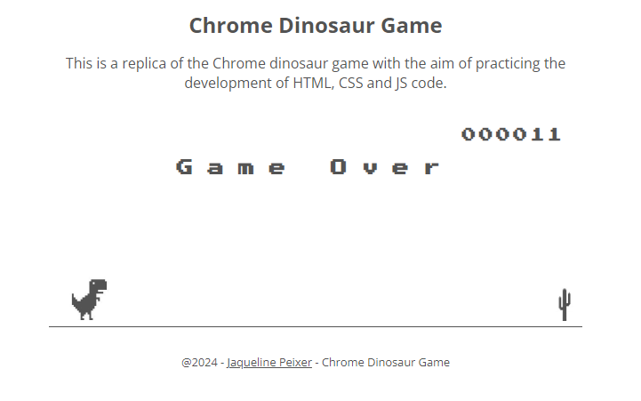

<h2>Chrome Game Dinosaur JavaScript</h2>

[pt-BR] Aplicativo desenvolvido com o objetivo de praticar integração REST com IONIC. O projeto em como principal função trazer os dados do tempo atual e dos próximos cinco dias.

[en] Application developed with the aim of practicing REST integration with IONIC. The project's main function is to bring data from the current weather and the next five days.

## 🚀 Technologies 
    - HTML
    - CSS
    - JavaScript

---

Made with 🧡 by Jaqueline Peixer:

    
    

